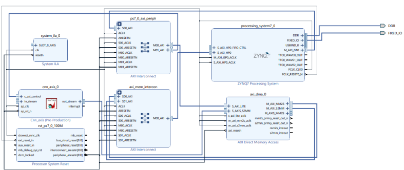

# FPGA-Accelerated CNN for Handwritten Digit Recognition

A complete hardware/software system for real-time handwritten digit recognition using a Convolutional Neural Network (CNN) accelerated on a Xilinx Zynq-7000 FPGA.

The project combines machine learning, computer vision, embedded Linux and FPGA hardware acceleration into a complete real-time recognition system.

---

# Project Overview

The application acquires handwritten digits from a smartphone camera, preprocesses the captured images, transmits them through Ethernet to a ZedBoard and performs CNN inference on a hardware accelerator implemented on the FPGA.

The complete system includes:

- CNN training using TensorFlow/Keras
- Fixed-point quantization
- Hardware accelerator implemented in Vitis HLS
- Vivado hardware integration
- PetaLinux TCP server
- PC application for image acquisition and preprocessing

---

# System Architecture

<p align="center">

</p>

The overall workflow consists of:

1. Image acquisition from a smartphone camera
2. Image preprocessing on the PC
3. Ethernet communication with the ZedBoard
4. CNN inference on the FPGA accelerator
5. Display of the predicted digit

---

# Software Application

<p align="center">

</p>

The desktop application provides:

- Live image acquisition
- Background calibration
- Digit detection
- CLAHE histogram equalization
- Thresholding
- Morphological filtering
- Image normalization (28×28 pixels)
- Ethernet communication
- Display of prediction results

---

# CNN Architecture

<p align="center">

</p>

The convolutional neural network was developed using TensorFlow/Keras and trained on the MNIST dataset together with custom handwritten digit images.

Architecture:

- 2 Convolutional Layers
- ReLU Activation
- MaxPooling
- Flatten Layer
- 2 Fully Connected Layers
- Softmax Output

---

# FPGA Hardware Architecture

<p align="center">

</p>

The hardware implementation includes:

- ARM Cortex-A9 Processor
- CNN Hardware Accelerator
- AXI Lite Interface
- AXI Stream Interface
- AXI DMA
- DDR Memory
- PetaLinux

The ARM processor configures the accelerator through AXI Lite while AXI DMA transfers image data and inference results between DDR memory and the FPGA accelerator.

---

# Quantization and Optimization

The trained floating-point CNN was converted into a mixed fixed-point implementation suitable for FPGA execution.

The optimization process included:

- Fixed-point quantization
- Mixed precision arithmetic
- Array partitioning
- Loop optimization
- Latency reduction

Mixed precision significantly improved the classification accuracy compared to uniform quantization while maintaining low hardware resource utilization.

---

# Experimental Results

<p align="center">

</p>

The project evaluates:

- Floating-point implementation
- Uniform fixed-point quantization
- Mixed precision quantization
- FPGA latency
- Hardware resource utilization
- Loop optimization

---

# Repository Structure

```text
FPGA-Accelerated-CNN-for-Handwritten-Digit-Recognition
│
├── docs
│   ├── Bachelor_Thesis.pdf
│   └── Presentation.pptx
│
├── hardware
│   ├── cnn.cpp
│   ├── cnn_axis.cpp
│   ├── cnn.h
│   ├── cnn_axis.h
│   ├── tb_cnn_axis.cpp
│   └── quantization scripts
│
├── software
│   ├── application.py
│   ├── fpga_server.c
│   └── train_mnist_cnn_custom.py
│
├── model
│   └── mnist_manual_cnn_final.h5
│
├── images
│
├── results
│
└── demo
```

---

# Technologies

- Python
- TensorFlow
- Keras
- OpenCV
- C/C++
- Vivado
- Vitis HLS
- PetaLinux
- AXI Lite
- AXI Stream
- AXI DMA
- Ethernet (TCP/IP)
- FPGA (Xilinx Zynq-7000)

---

# Key Features

✔ CNN-based handwritten digit recognition

✔ FPGA hardware acceleration

✔ Real-time image preprocessing

✔ Ethernet communication

✔ Embedded Linux server

✔ Hardware/software co-design

✔ Mixed precision quantization

✔ Hardware optimization using Vitis HLS

---

# Documentation

The repository also contains:

- Bachelor's Thesis
- Presentation
- Hardware source code
- Software source code
- CNN model
- Experimental results

---

# Author

**Maria Tertiu**

Bachelor's Degree Project

Faculty of Electrical Engineering and Computer Science
